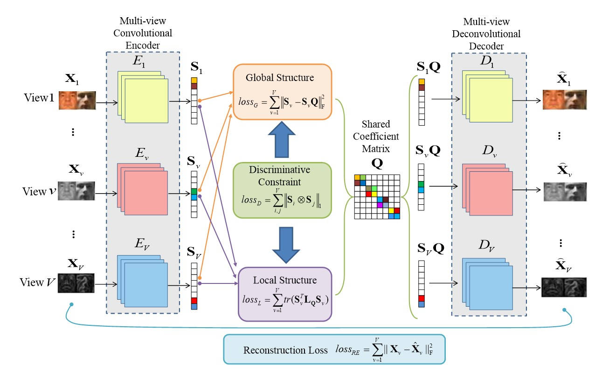
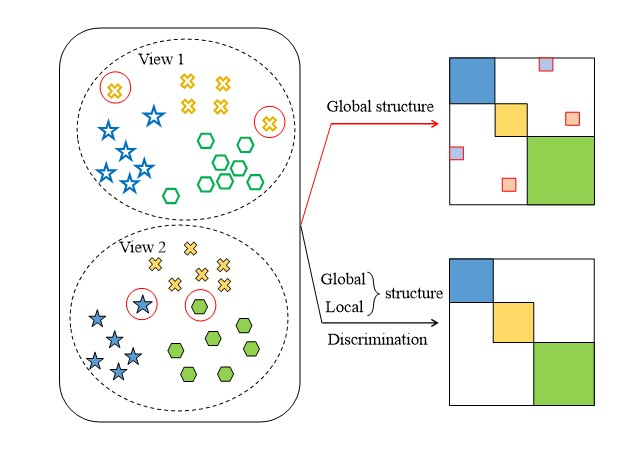

#DMSC-UDL: Deep Multi-view Subspace Clustering with Unified and Discriminative Learning#


This repo contains the source code and dataset for our TMM 2021 paper:
###Qianqian Wang, Jiafeng Cheng, Quanxue Gao, Guoshuai Zhao, Licheng Jiao, Deep Multi-view Subspace Clustering with Unified and Discriminative Learning, IEEE Transactions on Multimedia, 2020, 10.1109/TMM.2020.3025666.###

[Paper Link](https://ieeexplore.ieee.org/abstract/document/9204408/)  


**Bibtex**  

@article{Wang2020deepm,  
  title={ Deep Multi-view Subspace Clustering with Unified and Discriminative Learning},  
  author={Wang, Qianqian and Cheng, Jiafeng and Gao, Quanxue and Zhao, Guoshuai and Jiao, Licheng},  
  journal={IEEE Transactions on Multimedia},  
  volume={99},  
  number={9},  
  pages={1-11},  
  year={2021},   
}  
 
**DMSC-UDL Model:**

<div style="text-align: center; width: 900px; border: green solid 1px;">

<br></br>
<center></center>
</div>

Fig. 1. Multi-view clustering schematic diagram. The left half represents multi-view samples, and the right half represents shared connection matrices. Samples of the same color in view 1 and view 2 belong to the same cluster. The more concentrated the diagonal of the connection matrix is, the better the clustering effect is. Using only the global self-expression structure for each view to cluster, it is possible that the samples circled by red boxes with inaccurate weights are clustered into wrong clusters. Combining local structure and discriminative constraint with local graph structure for all views to improve the clustering effect can get a better clustering effect.  

<div style="text-align: center; width: 900px; border: green solid 1px;">

<br></br>
<center></center>
</div>
Fig. 3. The illustration of inter-cluster difference, where solid points and hollow points with the same shape represent different views, and different shapes represent different clusters.

**Dataset:**  

We validate the performance of  of DMSC-UDL on the four databases, i.e., Fashion-MNIST, COIL20, YoutubeFace (YTF), and FRGC database. 

Fashion-MNIST database: This database has the same number of images and the same size as the MNIST, but it is fairly more complicated. Instead of digits, it consists of various types of fashion products. We use the original image features as the first mode and the edge features of the extracted fashion product as the second mode.
COIL20 database: COIL20 collects 1440 128 \times 128 grayscale object images of 20 clusters viewed from varying angles. We use the original picture feature as the first mode and the edge feature of the extracted object as the second mode, just like the MNIST database.
Youtube-Face (YTF) database: we choose the first 41 subjects of YTF database. Faces inside images are first cropped and then resized to 55 by 55 sizes~\cite{b44}. In this paper, we implement its original RGB picture as the first mode, the gray picture converted from the original RGB picture as the second mode and the extracted edge feature as the third mode.
FRGC database: Using 20 random selected subjects from the original database, we collect 2,462 face images. Similarly, we first crop the face regions and resize them into 32 by 32 images. Like the YTF database, in this paper, we use its original RGB picture as the first mode, the grayscale image converted from the original RGB picture as the second mode, and the extracted edge feature as the third mode.

**Requirements**  

Python 3.6  
PyTorch 1.0


**Train the model**

```
python train.py
```

